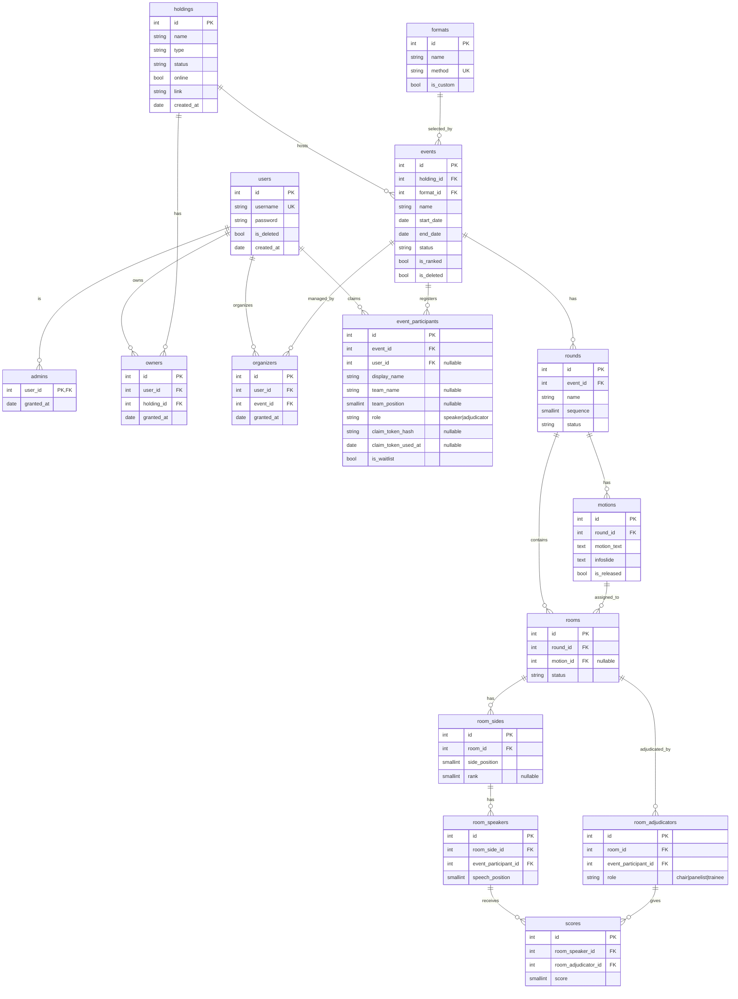

# 4. Holdings, Events, Rooms, and Format Plugins

## Status

Proposed

## Context

The current API is British Parliamentary (BP) specific:
- `holdings` already represent the owning organisation/container.
- `sessions` represent one dated debate event under a holding.
- `rooms` represent one concrete BP debate instance.
- `teams` are fixed pairs with `opener` and `closer`.
- `room_teams` store BP positions (`OG`, `OO`, `CG`, `CO`) and ranks.
- `room_speakers` store a user and a single inline score.
- `waitlists` are the only registration structure and require platform users.
- `rooms.judge` supports only one adjudicator.

This works for a simple BP event, but it prevents guest registration, adjudication
panels, per-adjudicator scores, and future debate formats without schema
changes.

## Decision

We will keep the existing project concept of `holdings` and translate the BP
schema into a debate-agnostic core:

- `holdings` remain the organisation/container layer.
- `sessions` become `events`.
- `rooms` remain the operational debate instance.
- `waitlists` and fixed `teams` become `event_participants`.
- `room_teams` become `room_sides`.
- `room_speakers` point to event participants instead of users.
- `rooms.judge` becomes `room_adjudicators`.
- Inline speaker scores move into `scores`.
- `motions` move from event-level to round-level because motions are debated
  and released per round.

The core database stores normalized event, room, participant, adjudication, and
score data. It does not store JSON format schemes or JSON configuration.

Debate mechanics live in backend format plugins. The `formats` table stores a
`method` string that must match a registered backend plugin. Adding a new debate
format requires a new backend mechanics plugin and a `formats` row, but should
not require redesigning the core schema.

Only BP is implemented first with method `british-parliamentary`.

Access and participation are separate:

- `admins` have global control.
- `owners` control holdings they own.
- `organizers` are assigned to one event and manage that event.
- adjudicators are event participants assigned to specific rooms through
  `room_adjudicators`.
- users are platform accounts that can register, claim event participants, and
  view stats.
- event participants are event-local people; they are either speakers or
  adjudicators, never both in the same event.

## BP Plugin Mechanics

The BP plugin is backend code registered as `british-parliamentary`. The core
API resolves it through `event -> format_id -> formats.method`.

The core stores ordered numeric positions. The BP plugin interprets them:

- room side positions: `0 = OG`, `1 = OO`, `2 = CG`, `3 = CO`
- speech positions: `0 = first speaker`, `1 = second speaker`
- adjudicator roles: `chair`, `panelist`, `trainee`

The plugin validates:

- each room has exactly 4 sides
- each side has exactly 2 speakers
- each room has at least one chair adjudicator
- side ranks are exactly `1`, `2`, `3`, `4`
- scores are inside the BP score range
- all room speakers are event participants with `role = speaker`
- all room adjudicators are event participants with `role = adjudicator`

## Current-To-New Translation

| Current v1 | v2 replacement | Reason |
|---|---|---|
| `holdings` | `holdings` | Already means organisation/container. |
| `sessions` | `events` | A session currently represents an event under a holding. |
| `waitlists` | `event_participants` | Registration must support users, guests, waitlist, adjudicators, and speakers. |
| `teams` | participant grouping fields | Participants are registered; teams are optional grouping metadata. |
| `rooms` | `rooms` | Existing project term for one concrete debate instance. |
| `rooms.judge` | `room_adjudicators` | Supports chairs, panelists, trainees, and future panels. |
| `room_teams` | `room_sides` | Stores side placement and rank without assuming a team table. |
| `room_speakers.user_id` | `room_speakers.event_participant_id` | Speakers may be guests without platform accounts. |
| `room_speakers.score` | `scores` | Scores become per speaker per adjudicator. |
| hardcoded BP checks | format plugin | BP mechanics move into `british-parliamentary`. |
| `motions.session_id` | `motions.round_id` | Motions belong to rounds; rooms can reference one. |

## Project Scheme

## Consequences

What becomes easier:
- Guests can register for an event before creating an account.
- A participant can later claim their event identity with a one-time token.
- Rooms can support adjudication panels.
- Scores are attributable to a specific adjudicator.
- Owners can delegate event management to organizers without giving holding
  ownership.
- Future formats can reuse the same core tables.

What becomes more difficult:
- Format mechanics move behind plugin boundaries.
- Controllers must resolve the event format before validating room and score data.
- Authorization has more contextual roles: holding owner, event organizer, and
  room adjudicator.
- Existing v1 test data cannot be automatically migrated cleanly.

What we are not doing now:
- No JSON format schemes or JSON config stored in the database.
- No first-class organisation table beyond existing `holdings`.
- No draw generation, break qualification, or adjudicator feedback engine.
- No non-BP plugin in the first implementation.
