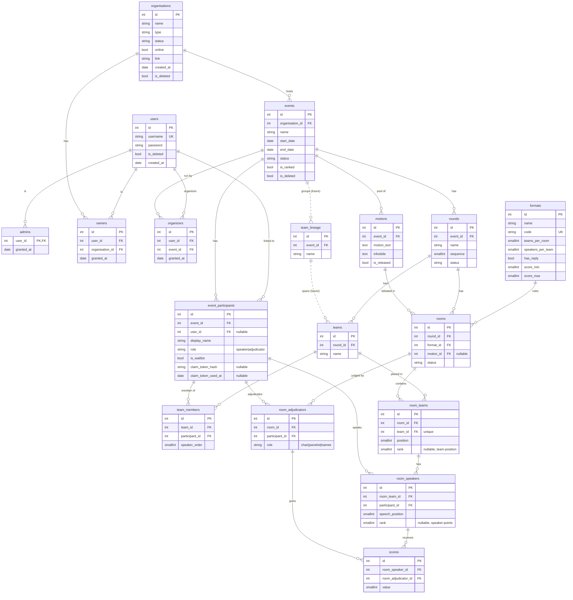

# 4. Organisations, Events, Rooms, and Data-Driven Formats

## Status

Proposed

## Context

The current API (v1) is British Parliamentary (BP) specific:

- `holdings` represent the owning organisation/container.
- `sessions` represent one dated debate event under a holding.
- `rooms` represent one concrete BP debate instance.
- `teams` are fixed pairs with `opener` and `closer`.
- `room_teams` store BP positions (`OG`, `OO`, `CG`, `CO`) and ranks.
- `room_speakers` store a user and a single inline score.
- `waitlists` are the only registration structure and require platform users.
- `rooms.judge` supports only one adjudicator.

This works for a simple BP event, but it prevents guest registration,
adjudication panels, per-adjudicator scoring, and future debate formats without
schema changes.

## Decision

Translate the BP schema into a debate-agnostic core that can describe any
format whose mechanics fit a small set of scalar parameters:

- `holdings` are renamed to `organisations` and gain richer descriptive fields.
- `sessions` become `events`.
- `events` group `rounds`, and `rounds` group `rooms`.
- `rooms` remain the operational debate instance.
- `waitlists` and fixed `teams` become `event_participants`.
- `teams` are round-scoped (a per-round lineup) with an explicit `team_members`
  join table.
- `room_teams` keep their name; BP-specific position enums become generic
  ordered positions.
- `room_speakers` point to event participants instead of users.
- `rooms.judge` becomes `room_adjudicators`.
- Inline speaker scores move into `scores`, one row per speaker per
  adjudicator.
- `motions` move to an event-level pool with `is_released`; a room references
  one motion through `rooms.motion_id`.

Format mechanics are **data-driven**, not plugin-driven. The `formats` table
stores scalar columns that fully describe the format's structural rules
(`teams_per_room`, `speakers_per_team`, `has_reply`, `score_min`, `score_max`).
Adding a new format is a single `INSERT` into `formats`. A single generic
backend validator reads the row for each room and enforces the rules. There is
no plugin code, no `is_custom` flag, and no JSON configuration in the database.

Only BP is shipped initially:

```sql
INSERT INTO formats (name, code, teams_per_room, speakers_per_team, has_reply, score_min, score_max)
VALUES ('British Parliamentary', 'BP', 4, 2, false, 50, 90);
```

Format binding is **per room** (`rooms.format_id`), which allows mixed-format
events. If that turns out to be undesirable, the constraint can be hoisted to
the event level later.

Access and participation are separate:

- `admins` have global control.
- `owners` control organisations they own.
- `organizers` are assigned to one event and manage that event.
- adjudicators are event participants assigned to specific rooms through
  `room_adjudicators`.
- users are platform accounts that can register, claim event participants, and
  view stats.
- event participants are event-local people; they are either speakers or
  adjudicators in a given event (separate rows are needed if the same person
  fills both roles).

Guests can register without an account. An event participant carries
`claim_token_hash` and `claim_token_used_at`; a one-time token endpoint lets
the participant later link the row to a real user.

State is tracked at two levels and enforced in a backend state map:

- `rounds.status`: `draft → scheduled → in_progress → completed`
- `rooms.status`: `pending → live → judging → completed` (`+ void`)

Soft delete (`is_deleted`) applies only to `users`, `events`, and
`organisations`.

## Translation From v1

| Current v1                  | v2 replacement                          | Reason                                                                       |
| --------------------------- | --------------------------------------- | ---------------------------------------------------------------------------- |
| `holdings`                  | `organisations`                         | Container is an organisation, with `type`, `status`, `online`, `link`.       |
| `sessions`                  | `events`                                | A session currently represents an event under a holding.                     |
| `waitlists`                 | `event_participants` + `is_waitlist`    | Registration must cover users, guests, waitlist, adjudicators, and speakers. |
| `teams` (holding-scoped)    | `teams` (round-scoped) + `team_members` | Per-round lineups support formats that reshuffle teams between rounds.       |
| `rooms`                     | `rooms`                                 | Existing project term for one concrete debate instance.                      |
| `rooms.judge`               | `room_adjudicators`                     | Supports chairs, panelists, trainees, and full panels.                       |
| `room_teams` BP enum        | `room_teams.position` smallint          | Generic ordered position; format validator interprets meaning.               |
| `room_speakers.user_id`     | `room_speakers.participant_id`          | Speakers may be guests without platform accounts.                            |
| `room_speakers.score`       | `scores` (per speaker per adjudicator)  | Enables panels and per-judge attribution.                                    |
| hardcoded BP checks         | generic validator + `formats` row       | Rules are derived from the format's scalar columns.                          |
| `motions.session_id`        | `motions.event_id`                      | Motions are an event-level pool; rooms reference one.                        |

## Project Scheme



Dashed edges and `team_lineage` are reserved for a future cross-round team
identity migration. They are not part of v2.

## Reply Speeches

Formats with reply speeches (`has_reply = true`) are handled by entering the
same `participant_id` in two `room_speakers` rows for the same room — one
substantive speech and one reply. This is a convention, not a database
constraint; ballot UIs must not deduplicate.

## Validator

A single backend validator reads the room's `formats` row and asserts:

- team count for the room equals `teams_per_room`
- each `room_team` has exactly `speakers_per_team` `room_speakers`
- each `score.value` is in `[score_min, score_max]`
- at least one `room_adjudicators` row with `role = chair`
- every `room_speakers.participant_id` belongs to an `event_participants` row
  with `role = speaker`
- every `room_adjudicators.participant_id` belongs to an `event_participants`
  row with `role = adjudicator`

Formats whose rules cannot be expressed as scalar columns (for example, Policy
cross-examination time blocks) will require either custom validator hooks or a
small predicate-rule child table; both are out of scope for v2.

## Consequences

What becomes easier:

- Guests can register for an event before creating an account.
- A participant can later claim their event identity with a one-time token.
- Rooms can support adjudication panels.
- Scores are attributable to a specific adjudicator.
- Owners can delegate event management to organizers without giving
  organisation ownership.
- Adding a new format is a single `INSERT`; no new code, no plugin.
- Mixed-format events are possible because `format_id` is per room.

What becomes more difficult:

- Controllers must resolve the format for a room before validating its shape
  and scores.
- Authorization has more contextual roles: organisation owner, event
  organizer, and room adjudicator.
- Existing v1 test data cannot be automatically migrated cleanly.
- Cross-round team standings are not first-class; persistent team identity
  must wait for a follow-up `team_lineage` migration.

What we are not doing now:

- No JSON format schemes or JSON configuration stored in the database.
- No backend format plugins; all format rules are columns on `formats`.
- No multi-criteria scoring (e.g. WSDC Matter/Manner/Method); a follow-up
  migration will add `format_score_criteria` and `scores.criterion_id`.
- No cross-round team identity (`team_lineage`).
- No DB-level enforcement of `rounds.status` / `rooms.status` transitions;
  only the backend state map enforces them.
- No draw generation, break qualification, or adjudicator feedback engine.
- No non-BP format row in the initial seed.
