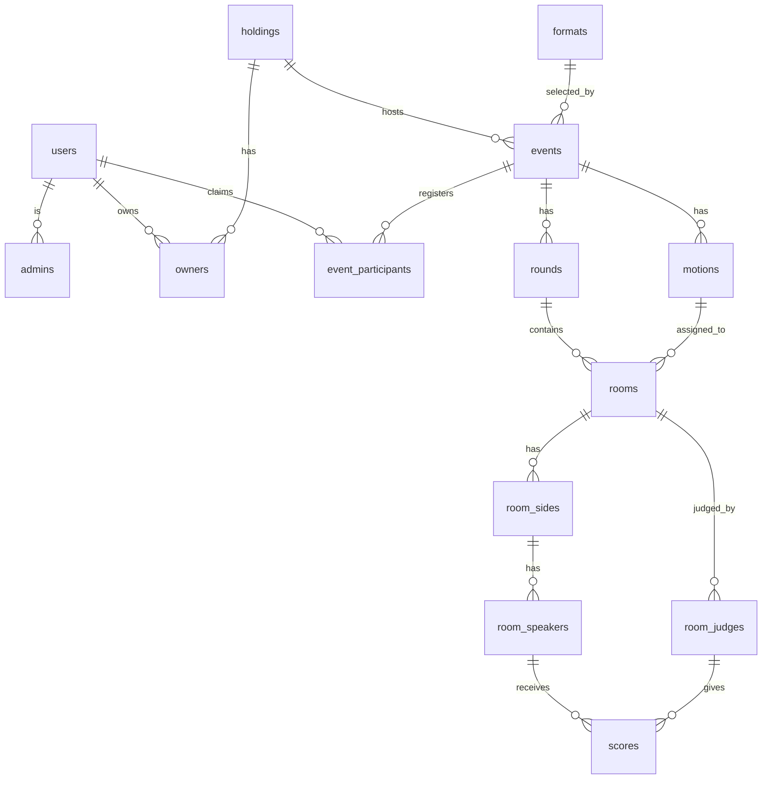

# 4. Holdings, Events, Rooms, and Format Plugins

## Status

Proposed

## Context

The current API is British Parliamentary (BP) specific:
- `holdings` already represent the owning organisation/container.
- `sessions` represent one dated debate event under a holding.
- `rooms` represent one concrete BP debate instance.
- `teams` are fixed pairs with `opener` and `closer`.
- `room_teams` store BP positions (`OG`, `OO`, `CG`, `CO`) and ranks.
- `room_speakers` store a user and a single inline score.
- `waitlists` are the only registration structure and require platform users.
- `rooms.judge` supports only one judge.

This works for a simple BP event, but it prevents guest registration, judging
panels, per-judge scores, and future debate formats without schema changes.

## Decision

We will keep the existing project concept of `holdings` and translate the BP
schema into a debate-agnostic core:

- `holdings` remain the organisation/container layer.
- `sessions` become `events`.
- `rooms` remain the operational debate instance.
- `waitlists` and fixed `teams` become `event_participants`.
- `room_teams` become `room_sides`.
- `room_speakers` point to event participants instead of users.
- `rooms.judge` becomes `room_judges`.
- Inline speaker scores move into `scores`.

The core database stores normalized event, room, participant, judging, and score
data. It does not store JSON format schemes or JSON configuration.

Debate mechanics live in backend format plugins. The `formats` table stores a
`method` string that must match a registered backend plugin. Adding a new debate
format requires a new backend mechanics plugin and a `formats` row, but should
not require redesigning the core schema.

Only BP is implemented first with method `british-parliamentary`.

## Current-To-New Translation

| Current v1 | v2 replacement | Reason |
|---|---|---|
| `holdings` | `holdings` | Already means organisation/container. |
| `sessions` | `events` | A session currently represents an event under a holding. |
| `waitlists` | `event_participants` | Registration must support users, guests, waitlist, judges, and speakers. |
| `teams` | participant grouping fields | Participants are registered; teams are optional grouping metadata. |
| `rooms` | `rooms` | Existing project term for one concrete debate instance. |
| `rooms.judge` | `room_judges` | Supports chairs, panelists, trainees, and future panels. |
| `room_teams` | `room_sides` | Stores side placement and rank without assuming a team table. |
| `room_speakers.user_id` | `room_speakers.event_participant_id` | Speakers may be guests without platform accounts. |
| `room_speakers.score` | `scores` | Scores become per speaker per judge. |
| hardcoded BP checks | format plugin | BP mechanics move into `british-parliamentary`. |
| `motions.session_id` | `motions.event_id` | Motions belong to the event; rooms can reference one. |

## Project Scheme

## Consequences

What becomes easier:
- Guests can register for an event before creating an account.
- A participant can later claim their event identity with a one-time token.
- Rooms can support judge panels.
- Scores are attributable to a specific judge.
- Future formats can reuse the same core tables.

What becomes more difficult:
- Format mechanics move behind plugin boundaries.
- Controllers must resolve the event format before validating room and score data.
- Existing v1 test data cannot be automatically migrated cleanly.

What we are not doing now:
- No JSON format schemes or JSON config stored in the database.
- No first-class organisation table beyond existing `holdings`.
- No draw generation, break qualification, or adjudicator feedback engine.
- No non-BP plugin in the first implementation.
